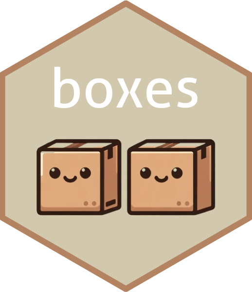

<!-- README.md is generated from README.Rmd. Please edit that file -->

```{r, include = FALSE}
knitr::opts_chunk$set(
  collapse = TRUE,
  comment = "#",
  fig.path = "man/figures/README-",
  out.width = "100%"
)
library(boxes)
box_delete("test")
```

# boxes: store and retrieve arbitrary R objects

<a href="https://github.com/markheckmann/boxes"></a>

<!-- badges -->
[]()
[]()
<!-- badges -->

The goal of `boxes` is to provide a convenient way to store R objects or arbitrary files (plus additional notes) and retrieve them again later. 

To use the package, you need to know a few terms:

  * `box`: A container to store things. Things can be R objects or files.
  * `item`: Anything object is stored inside a box. 
  * `pack`: Adding an item to a box.
  * `pick`: Retrieving an item from a box.

Boxes are stored on your disk. Hence, anything put into it will remain there until you delete the box.
Technically, each box is a separate SQLite database. You can create as many boxes as you need.


## Installation

You can install the dev version of `boxes` like so:

```{r eval=FALSE}
devtools::install_github("markheckmann/boxes")
```


## Usage

Load package and show existings boxes. A box with your username exists by default.

```{r example}
library(boxes)
boxes()
```

Create a new box and see that it is empty.

```{r new-box}
box_create("test")
box_active()
box()
```

Add a new object to the box.

```{r pack}
pack(mtcars, "my_data", "Data to keep for later")
box()
```

Retrieve an object from a box and remove it.

```{r pick}
x <- pick("my_data")
identical(x, mtcars)
remove("my_data")
```

Check if item is gone and delete box.

```{r delete}
box()
box_delete("test")
boxes()
```

